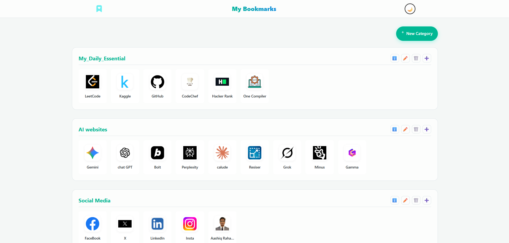
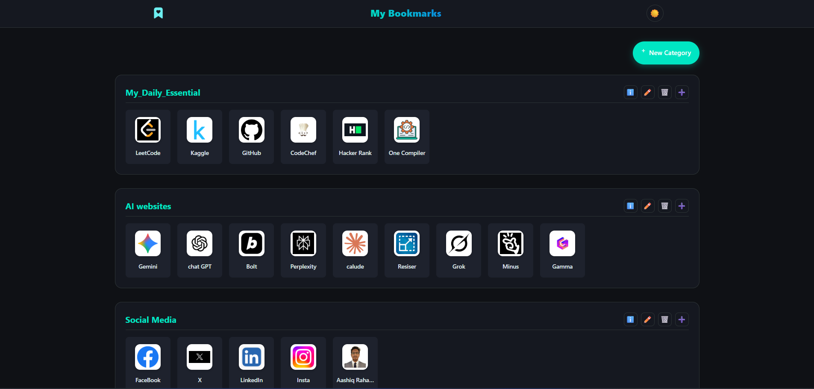

# ✨ Personal Bookmark Manager

<div align="center">


<br />

**A visually stunning, fully responsive, and customizable bookmark manager.** Organize your daily links with drag-and-drop functionality, glassmorphism design, and persistent dark mode.

[🔴 **LIVE DEMO**](https://aashiqrahaman.github.io/My_Bookmarks/)

</div>

---

## 📸 Screenshots

<div align="center"> 
  <table width="100%">
    <tr>
      <th width="50%">☀️ Light Mode</th>
      <th width="50%">🌙 Dark Mode</th>
    </tr>
    <tr>
      <td></td>
      <td></td>
    </tr>
  </table>
</div>

---

## 🚀 Key Features

* **🎨 Glassmorphism UI:** Modern, translucent design with a dynamic particle background.
* **🌗 Dark/Light Mode:** Toggles themes instantly and **remembers your preference** (using LocalStorage).
* **✋ Drag & Drop:** Easily reorder **Categories** and individual **Bookmarks** using *SortableJS*.
* **📱 Fully Responsive:** Adapts perfectly to Desktops, Tablets, and Mobile devices (CSS Grid).
* **💾 Local Storage:** Your data is saved automatically in your browser. No database required.
* **✨ Interactive:** Smooth hover effects, modal popups for editing, and delete confirmations.

---

## 🛠️ Tech Stack

* **Core:** HTML5, CSS3 (Custom Variables), Vanilla JavaScript (ES6+).
* **Framework:** Bootstrap 4 (Grid & Utilities).
* **Icons:** Ionicons.
* **Libraries:**
    * `SortableJS` (For drag-and-drop functionality).
    * `Particle Animation` (Custom Canvas implementation).

---

## 📂 Project Structure

The project structure is simple and lightweight:

```text
📦 Bookmark-Manager
 ┣ 📜 .gitignore       # Git configuration
 ┣ 📁 Assets           # Website Assets
 ┣ 📜 index.html       # Main HTML structure & Libraries
 ┣ 📜 script.js        # Core logic (Storage, Drag&Drop, Theme)
 ┗ 📜 style.css        # Custom styling, Variables, & Glassmorphism
 ```
⚡ Getting Started
To run this project locally on your machine:

Clone the repository

```Bash
git clone https://github.com/AashiqRahaman/My_Bookmarks
```
Navigate to the folder

```Bash
cd My_Bookmarks
```
Open index.html Simply double-click index.html to open it in your default browser.

⚙️ Customization
Changing Default Data
If you want to change the "Starter" bookmarks that appear for new users, open script.js and locate the loadFromStorage() function:
```bash
JavaScript

// script.js - Line ~18
return [
  {
    "typeName": "Your New Category",
    "description": "Description here",
    "bookmarks": [ ... ]
  }
];

#OR Just Create Bookmark Mannualy in Your Browser Copy js Data from local storage if you want any backup.
```
Resetting Data
If you want to clear your local changes and see the default data again:

Open browser Developer Tools (F12).

Go to Application -> Local Storage.

Delete the key my_bookmarks_data_v2.

Refresh the page.

🤝 Contributing
Contributions, issues, and feature requests are welcome! Feel free to fork the repo and submit a pull request.
```
Fork the Project

Create your Feature Branch (git checkout -b feature/AmazingFeature)

Commit your Changes (git commit -m 'Add some AmazingFeature')

Push to the Branch (git push origin feature/AmazingFeature)

Open a Pull Request
```